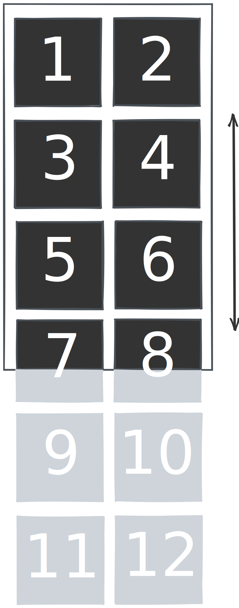

# Grid

Lists in an organized grid.

## Attributes
| Property                | Type              | Required   | Description          |
| ----------------------- | ----------------- | :--------: | -------------------- |
| columnCount             | number            |     ✓      | Number of columns in grid |
| rowHeight               | number            |     ✓      | Fixed row height     |
| columnWidth             | number            |     ✓      | Fixed column width   |
| onScroll                | function          |            | Callback invoked whenever the scroll offset changes |
| scrollTop               | function          |            | Vertical offset      |
| className               | string            |            | CSS class name       |


## Mockup


## Example

```jsx
import ReactDOM from 'react-dom';
import { Grid } from "monolieta-virtual-scroll";

const Example = () => {
    const rows = new Array(50000).fill(0).map((_, i) => (
        <div key={i} syle={{ width: "100%", height: "100%" }}>
            {i}
        </div>
    ));

    return (
        <div style={{ width: "400px", height: "300px" }}>
            <Grid columnCount={2} rowHeight={100} columnWidth={100}>
                {rows}
            </Grid>
        </div>
    );
};

ReactDOM.render(<Example />, document.getElementById('root'));
```
