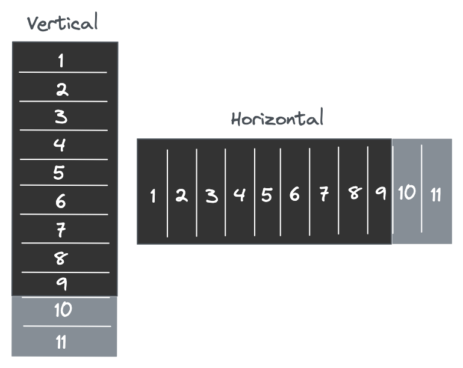

# List

List (rows) of elements

## Attributes
| Property                | Type                          | Description          |
| ----------------------- | ----------------------------- | -------------------- |
| className               | string                        | CSS class name       |
| columnWidth             | number                        | Fixed column width   |
| direction               | "vertical" | "horizontal"     | Displacement direction |
| onScroll                | function                      | Callback invoked whenever the scroll offset changes |
| padding                 | number                        | Padding is used to create space around an element's content |
| rowHeight               | number                        | Fixed row height     |
| scrollLeft              | number                        | Horizontal offset    |
| scrollTop               | number                        | Vertical offset      |

## Mockup


## Usage
```jsx
import ReactDOM from 'react-dom';
import { List } from "monolieta-virtual-scroll";

const Example = () => {
    const rows = new Array(50000).fill(0).map((_, i) => (
        <div key={i} style={{ width: "100%", height: "100%" }}>
            {i}
        </div>
    ));

    return (
        <div style={{ width: "400px", height: "300px" }}>
            <List rowHeight={100}>
                {rows}
            </Grid>
        </div>
    );
};

ReactDOM.render(<Example />, document.getElementById('root'));
```
